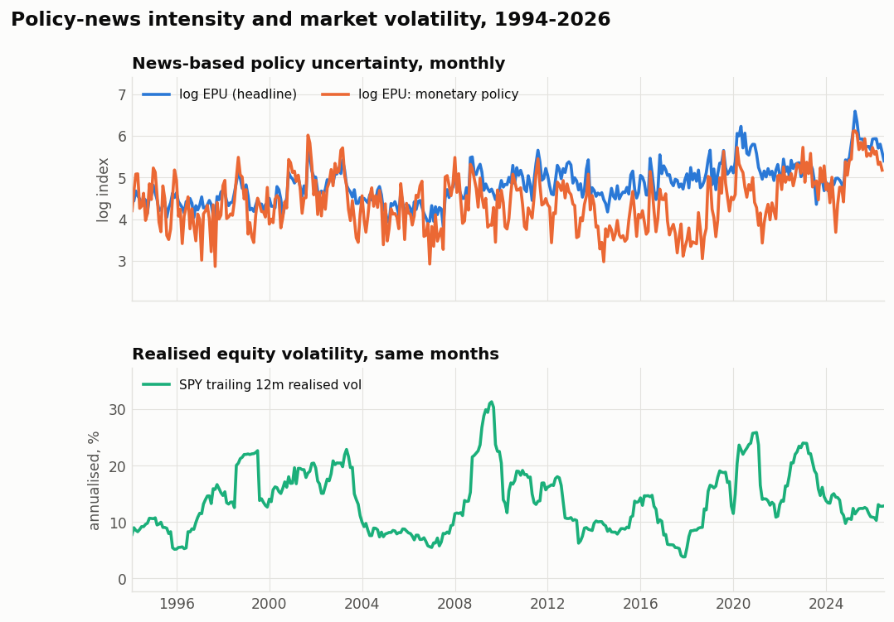
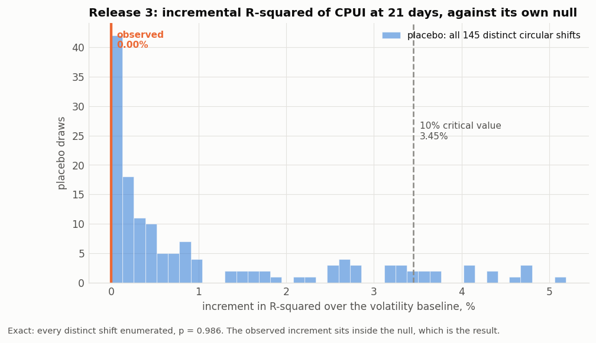
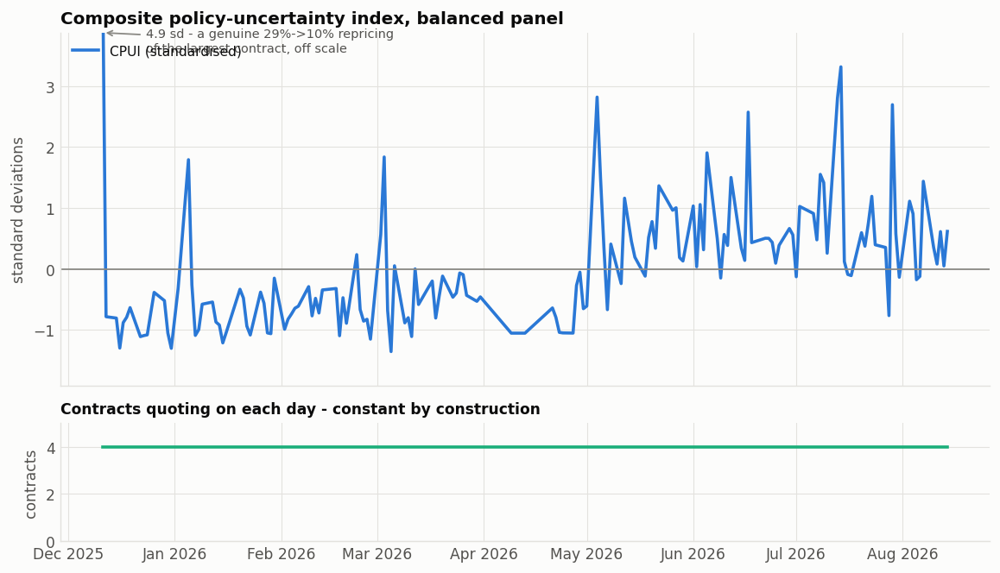

# Prediction markets, policy news, and US equities

A four-part study of quantitative proxies for public views on US fiscal, monetary, and
trade policy, tested against US equity outcomes under one specification.

- **Release 1** compares Polymarket implied probabilities with US equity and rates ETFs
  over 250 trading days.
- **Release 2** applies the same tests to the Baker, Bloom, and Davis news-based
  Economic Policy Uncertainty index and its categorical sub-indices, on both the Release
  1 window and the full 1993–2026 sample.
- **Release 3** converts raw probabilities into interpretable factors, combines them in
  a composite policy uncertainty index, and tests whether it improves volatility
  forecasts.
- **Release 4** puts the same specification on 390 months of the Baker, Bloom, Davis and
  Kost Equity Market Volatility tracker, where the sample is long enough for the
  question to be answerable.

## What the study found

**One real effect, and it is not usable.** Release 4 identifies a robust association
between month-*t* policy-news intensity and month-*t+1* absolute return — ΔR² = 5.96%
over an autoregressive volatility baseline, confirmed out of sample at +7.7% OOS R².
It does not survive the publication lag: the index is not released until several days
into the target month, and at the lag a person could actually have traded, the
out-of-sample gain is +0.04%.

Everything else is null, and the nulls are the substance:

- Release 1 finds same-day co-movement in the directions theory predicts, but the daily
  data cannot establish which market moves first — prediction-market bars are stamped
  after the equity close, and 38% of the event-study move lands before the probability
  jumps.
- Release 2 finds nothing on Release 1's eleven months and eleven significant
  relationships over 400. The binding constraint is sample length, not the proxy.
- Release 3 finds nothing. Its first version reported a strong result that turned out to
  be a shared time trend, validated by a placebo a deterministic ramp also passes, on an
  uncorrected grid, from an aggregate that is 82% one contract.

## On the numbers below

Every quantitative claim in this repository was recomputed independently by an
adversarial review before publication. **Those reviews overturned a headline result in
Releases 2, 3 and 4** — the comparison window, the trend control, and the publication
lag respectively. Where a number differs from an earlier draft, the section says which
was wrong and why. The corrections are documented rather than quietly applied, because
in every case the defective version produced the more impressive result, and that
pattern is the most portable thing here.

---

# Release 1: Polymarket implied probabilities

## What was tested

Seven contracts were selected through keyword searches of the Polymarket Gamma API.
The searches covered the five policy themes in the project brief, and contracts were
then ranked by trading volume.

| Contract | Theme | Volume (USD) |
|---|---|---:|
| Fed September 2026: no change | monetary | 16,181,392 |
| Fed September 2026: +25bp | monetary | 14,337,501 |
| Fed rate hike in 2026 | monetary | 8,206,364 |
| US government shutdown in 2025 | fiscal | 3,512,315 |
| US recession by end of 2026 | growth | 1,717,659 |
| US-Korea trade deal before 2027 | trade | 59,657 |
| US defaults on debt by 2027 | sovereign debt | 16,228 |

The contracts were paired with SPY, TLT, XLF, XLI, and VIXY. Together they cover broad
equities, long-duration bonds, financials, industrials, and a proxy for implied
volatility.

The sample runs from 2025-09-03 to 2026-08-31 and contains 250 trading days. This
one-year window is the main constraint on the analysis.

## Results

### 1. Same-day co-movement

| Contract | Asset | n | corr | β | t (OLS) | t (HC3) | p, FDR |
|---|---|--:|--:|--:|--:|--:|--:|
| Sept-2026 +25bp | VIXY | 75 | 0.293 | 0.147 | 2.62 | 3.84 | 0.004 |
| Sept-2026 +25bp | SPY | 75 | −0.307 | −0.046 | −2.76 | −3.76 | 0.004 |
| Sept-2026 no change | SPY | 74 | 0.266 | 0.036 | 2.34 | 3.29 | 0.013 |
| US recession 2026 | XLI | 202 | −0.211 | −0.124 | −3.05 | −2.65 | 0.046 |
| Fed hike 2026 | VIXY | 162 | 0.233 | 0.182 | 3.02 | 2.64 | 0.046 |
| Sept-2026 no change | VIXY | 74 | −0.220 | −0.098 | −1.91 | −2.58 | 0.049 |

After Benjamini-Hochberg correction at 10%, 12 of the 25 pairs are significant. When
the odds of a rate increase rise, equities and long bonds fall while implied
volatility rises. The "no change" contract moves in the opposite direction. The two
low-volume contracts, the US-Korea trade deal at about $60,000 and US debt default at
about $16,000, show no significant relationship. Their daily probability changes are
exactly zero on 21% to 32% of observations.

### 2. The data do not show which market moves first

Bidirectional Granger tests at lags 1 through 5 produce no significant result after
correction in either direction. The smallest FDR-adjusted p-value is 0.979. Two timing
problems limit what those tests can tell us:

- A Polymarket daily bar is stamped at 00:00 UTC, which is 19:00 or 20:00 in New York.
  That is three to four hours after the equity close. A same-day correlation therefore
  pairs an asset return with a probability observation that had the whole afternoon to
  absorb it.
- In the event study, an average of 38% of the cumulative abnormal move occurs before
  the recorded probability jump.

Release 1 supports a claim of same-day co-movement. It does not support a claim about
direction. That would require intraday data.

### 3. Event study results are descriptive

The event study contains 33 probability jumps across seven contracts, with three to
nine events per contract and some overlapping windows. No result remains significant
after correction. The output tables report the cumulative window as `car_window`, not
an "h-day response". They also include `pre_share_of_move`, which makes pre-event drift
visible.

---

# Release 2: news-based policy uncertainty

Release 2 replaces the prediction market proxy with the Baker, Bloom, and Davis
news-based EPU index and repeats the analysis. Results are reported for two windows
because the difference between them is central to the interpretation.

## What was tested

Monthly SPY outcomes were regressed on EPU levels and first differences, in logs. Five
targets were used, and each is labelled by kind:

| Target | Kind |
|---|---|
| contemporaneous monthly return | contemporaneous |
| contemporaneous absolute monthly return | contemporaneous |
| trailing 12-month realised volatility (log) | contemporaneous |
| next month absolute return | forward |
| forward 12-month realised volatility (log) | forward |

This distinction matters. A trailing 12-month volatility at month *t* is a function of
returns from *t-11* to *t*, so regressing it on EPU at month *t* is a contemporaneous
statement with eleven months of backward overlap. It is not a forecast, however large
the R² looks. The corresponding forward measure appears in the same table so readers
can compare the two directly.

Eight regressors were used: levels and log differences of the headline index and of the
three categorical sub-indices that FRED publishes, `EPUMONETARY`, `EPUTRADE`, and
`EPUSOVDEBT`.

Each of the seven Release 1 contracts is mapped to a theme and, where one exists, to a
categorical index. Two themes have no published counterpart. The recession and
government shutdown markets have no matching sub-index, which the mapping table records
as `(none published)` rather than silently reassigning them.

## Results

### 1. Daily analysis was unavailable

The environment used for these results could not retrieve the daily EPU series. The
retrieval channel truncates `All_Daily_Policy_Data.csv` at roughly 2,900 rows, ending
in mid-1992, so none of the observations overlaps the price window. The daily result is
therefore marked unavailable. On a networked machine, `python -m pmeq.datasets
refresh` downloads the file and the code detects it automatically.

### 2. No adjusted associations in the Release 1 window

Restricted to the months Release 1 estimates on, 24 of the 40 regression cells are even
estimable, the largest sample is 11 months, and no cell survives FDR correction at 10%.
The largest absolute t-statistic is 2.64.

The window is defined as the span of the price panel, which is what Release 1 actually
estimates on. It is not the union of the contracts' quote dates. That union starts
eight months earlier, because one contract quotes from 2025-01 while Release 1 excludes
it from the correlation work, so using it would compare against months Release 1 never
sees.

### 3. Full-sample associations

| Target | Regressor | n | β | t (HAC) | R² |
|---|---|--:|--:|--:|--:|
| contemporaneous absolute return | log EPU monetary | 400 | 0.0108 | 3.90 | 0.065 |
| trailing 12m realised vol (log) | log EPU sovereign debt | 389 | 0.0793 | 3.50 | 0.069 |
| trailing 12m realised vol (log) | log EPU monetary | 389 | 0.2403 | 3.46 | 0.134 |
| contemporaneous return | Δlog EPU | 401 | −0.0332 | −3.39 | 0.040 |
| next month absolute return | log EPU monetary | 401 | 0.0082 | 3.31 | 0.037 |
| trailing 12m realised vol (log) | log EPU | 390 | 0.3295 | 3.01 | 0.136 |

Across 389 to 402 months, 11 of 40 cells survive FDR at 10%. The relationships are
modest, with R² between 0.01 and 0.14, and the strongest of them are the overlapping
volatility targets whose kind is contemporaneous rather than forward.

### 4. Could eleven months have found what four hundred months finds?

Power was estimated by treating each full-sample R² as the true effect size and asking
how often an eleven-month sample would detect it:

| Measure | Median power |
|---|---:|
| single test at α = 0.05 | 0.093 |
| the same, at the Bartlett effective n | 0.074 |
| against the FDR screen actually applied | 0.010 |

Only 8 of the 11 cells are estimable on the short window at all. The three trailing
12-month volatility targets are not, because a target built from a twelve-month window
cannot be estimated on eleven months of data.

A median power of 0.01 against the screen actually applied means that a null result in
this window carries almost no information. At that power, the short-window results
cannot distinguish no relationship from effects of the size observed in the full
sample.

### 5. Do the two proxies measure the same thing?

| Market | Theme | Categorical EPU | n months | corr, levels | corr, changes |
|---|---|---|--:|--:|--:|
| Fed hike 2026 | monetary | EPUMONETARY | 7 | −0.784 | −0.094 |
| US-Korea trade deal 2027 | trade | EPUTRADE | 8 | −0.511 | −0.480 |
| US debt default 2027 | sovereign debt | EPUSOVDEBT | 8 | −0.596 | 0.068 |
| US government shutdown 2025 | fiscal shutdown | EPUSOVDEBT | 9 | 0.068 | 0.463 |

These overlaps are seven to nine months long. The table is reported as descriptive and
nothing is inferred from it. At these sample sizes the correlations are not
distinguishable from noise, and the sign disagreement between levels and changes is
what one would expect from that.



---

# Release 3: from raw probabilities to a policy-uncertainty index

Raw contract probabilities do not have a consistent interpretation as uncertainty. A
market at 0.90 and one at 0.10 both express confidence, while a market at 0.50 is
maximally uncertain. Regressing probability levels on returns therefore mixes
direction with uncertainty.

Release 3 derives four factors from each contract: logit level, binary entropy (how
unresolved the question is), flow (`|Δ logit p|`, a measure of incoming news), and
drift. It aggregates the factors by trading volume, adds a cross-sectional dispersion
term, and combines them in an equal-weighted composite called CPUI. The composite has
no fitted parameters or sample-fitted weights. The targets are realised volatility
over the next 5, 10, and 21 days. Policy uncertainty is more likely to affect market
risk than the direction of returns, which is difficult to forecast.

The corrected result is null. Reaching it required identifying several problems in an
earlier specification.

## The first version of this release was wrong

The earlier version reported that aggregate entropy added 8.9% to R² at five days,
with a placebo p-value of 0.004, and described it as a hypothesis worth pursuing. An
adversarial review found five problems. Each one made the initial result look stronger
than the corrected result.

### Shared time trend

`agg_entropy` correlates +0.84 with elapsed time over the selected window and fails an
ADF test. The volatility baseline contains trailing realised volatility, VIXY, and
absolute return, but no time trend. The index was therefore capturing drift that the
baseline did not model. Adding a linear time index removes 94% to 100% of the apparent
incremental R²:

| Horizon | Signal | ΔR² without trend | ΔR² with trend | share from trend | t without | t with |
|---|---|--:|--:|--:|--:|--:|
| 5 | agg_entropy | 0.0886 | 0.0049 | 94% | 1.79 | 0.53 |
| 10 | agg_entropy | 0.1509 | 0.0229 | 85% | 2.10 | 1.14 |
| 21 | agg_entropy | 0.1928 | 0.0022 | 99% | 3.21 | 0.24 |
| 21 | CPUI | 0.0382 | 0.0000 | 100% | 1.87 | 0.04 |

### Placebo failure under a trending signal

Circularly shifting a trending signal creates a sawtooth with a discontinuity at the
wrap point. This makes the shifted series a worse regressor than the original, places
the null distribution too low, and causes the test to reject too often. A deterministic
ramp passes the old test at every horizon. Independent random walks passed about 19%
of the time against a nominal 10% threshold. The corrected model includes the trend in
the baseline, and a guardrail test checks that this failure does not recur.

### An unattainable reported p-value

The original p-value of 0.004 was outside the resolution of the design. A 160-day panel
has only about 145 distinct circular shifts, so 500 random draws mostly repeat the same
shifts. The test resolution is about 1/145, or 0.007. The placebo now enumerates every
distinct shift and calculates the exact p-value as `(r+1)/(m+1)`. This construction
cannot produce the 0.000 previously shown in the construction robustness table.

### No correction for multiple tests

The earlier analysis tested 15 cells without a multiplicity correction, although
Releases 1 and 2 correct across their grids. Release 3 now applies BH-FDR. The signal
sets overlap because CPUI and entropy plus flow both contain `agg_entropy`. BH remains
valid and conservative under this type of positive dependence.

### An aggregate dominated by one contract

| Contract | Volume (USD) | Weight | corr with the aggregate |
|---|---:|--:|--:|
| Fed rate hike in 2026 | 8,206,364 | 0.821 | 0.993 |
| US recession by end-2026 | 1,717,659 | 0.172 | −0.619 |
| US-Korea trade deal | 59,657 | 0.006 | −0.007 |
| US debt default by 2027 | 16,228 | 0.002 | −0.300 |

The `fed_hike_2026` contract has 82.1% of the weight and a 0.993 correlation with the
aggregate. Its probability moves steadily toward 0.5 during the window, which produces
the trend. The other three contracts share the remaining 18% of the weight, and two
have negligible weights.

## What the corrected analysis finds

After controlling for trend, matching the bandwidth to the forecast overlap,
enumerating the null, and applying FDR correction, none of the 15 cells is significant
at 10%, either before or after correction. The smallest raw placebo p-value in the grid
is 0.31. At 21 days, the composite index adds 0.0006% to R², while the null
distribution has a 10% critical value of 3.45%.



The CPUI figure shows the contract roster beneath the index so that a change in
membership is not mistaken for a change in the index level.



## Sensitivity checks

### Panel selection

`select_balanced_panel` chooses the contracts and the window from the data. The placebo
rotates the signal only within that selected rectangle, so it does not account for the
selection step. Values of 100, 120, and 150 for `min_days` all select the same
four-contract rectangle. A value of 180 selects a different three-contract rectangle
and reverses the sign of *t* at two of the three horizons. The sensitivity table reports
this dependence on the selection constant.

### Levels and first differences

A regression of CPUI on log VIXY in levels gives β = −0.060 and t = −3.56, implying
that higher policy uncertainty is associated with lower implied volatility. Both
series fail an ADF test in this window. VIXY is a short-dated VIX futures ETF and loses
43 log percent to roll decay over eight months. In first differences, the sign becomes
positive and remains significant (β = +0.011, t = +3.33). This direction is consistent
with the hypothesis, and only the first-difference specification meets the stationarity
requirement. The output table reports both specifications and includes a stationarity
verdict for each.

---

# Release 4: the long sample, and what it costs to be usable

Releases 1 to 3 all end in the same place: the window is too short to answer the
question. Release 4 removes that constraint. The Baker, Bloom, Davis and Kost Equity
Market Volatility tracker is a newspaper-based measure of volatility-relevant news
flow, published monthly with policy-specific components, and it gives **390 usable
months** against Release 3's 159 trading days.

The specification keeps the same shape as Release 3 — a persistent uncertainty index, an
autoregressive volatility baseline to beat, HAC errors, a circular-shift placebo — so a
difference in verdict is attributable to power rather than to a change of model. Every
correction Release 3 needed is applied here from the start: a linear trend in the
baseline, an exactly enumerated placebo, BH-FDR across the grid, a bandwidth floored at
the target's overlap, and a stationarity verdict for every signal, target and control.

**There is a real effect here, and it is not usable.** Those are two separate findings
and the release reports both.

## The trend control, as a control

Release 3's result was a shared time trend. Running the same decomposition here is how
we know that was a short-window artefact rather than a property of news-based measures:

| Signal | corr with elapsed time | ΔR² without trend | ΔR² with trend |
|---|--:|--:|--:|
| log EMV overall | −0.005 | 0.0599 | 0.0596 |
| log EMV monetary | +0.019 | 0.0578 | 0.0578 |
| Release 3's `agg_entropy` | **+0.84** | 0.0886 | **0.0049** |

Over 390 months the EMV series are stationary and trendless, and the control removes
essentially nothing. Over eight months Release 3's index was almost pure drift.

## The effect

Over a baseline of trailing 12-month realised volatility, |return| and a trend, log EMV
overall adds **ΔR² = 5.96%** to a forecast of next month's |SPY return|:

| Target | Signal | n | ΔR² | t (HAC) | placebo p | FDR p |
|---|---|--:|--:|--:|--:|--:|
| next month \|return\| | EMV overall | 390 | 0.0596 | 4.27 | 0.0028 | 0.0102 |
| next month \|return\| | EMV monetary | 390 | 0.0578 | 4.92 | 0.0028 | 0.0102 |
| next month \|return\| | EMV policy pair | 390 | 0.0578 | 4.82 | 0.0028 | 0.0102 |
| next month \|return\| | EPU headline | 390 | 0.0210 | 3.12 | 0.0028 | 0.0102 |
| forward 12m vol (log) | EMV overall | 379 | 0.0619 | 3.91 | 0.1192 | 0.3065 |
| next month \|return\| | EMV trade | 390 | 0.0022 | 1.06 | 0.3598 | 0.4317 |

Five of eighteen cells survive FDR at 10%; four of twelve forward-looking ones.

The placebo p of 0.0028 is 1/353 — no shift out of 352 beat the observed increment. That
is the floor of the design, so it is worth checking the gap is real rather than a
resolution artefact: the null has mean 0.0033 and a **maximum of 0.0317**, against an
observed 0.0596. The observed value is 13.6 standard deviations above the null mean and
nearly twice the largest value the null ever reaches.

It also survives everything that broke the earlier releases. The bandwidth is irrelevant
(t = 4.26 / 4.27 / 4.05 / 3.98 / 3.96 at 1, 5, 10, 20, 30 lags, because the target has no
overlap). A richer AR baseline does not absorb it (adding eleven lags of |return| leaves
ΔR² = 0.050, t = 3.63). It holds in both halves (1994–2009: t = 2.94; 2010–2026:
t = 3.27). And roughly half of it comes from high-volatility months — dropping the top 5%
by |return| leaves ΔR² = 0.033, t = 3.65 — which is a dependence worth stating, but it
survives every cut including winsorising.

## It is one finding, not four

Four cells clear the FDR screen, which reads as four results. Conditioning each on the
others:

| Signal | ΔR² alone | t alone | ΔR² given the others | t given the others |
|---|--:|--:|--:|--:|
| EMV overall | 0.0596 | 4.27 | 0.0087 | 1.85 |
| EMV monetary | 0.0578 | 4.92 | 0.0076 | 1.87 |
| EMV trade | 0.0022 | 1.06 | 0.0060 | −1.80 |
| EPU headline | 0.0210 | 3.12 | 0.0029 | 1.36 |

None of them stands up once the others are present. EMV overall and EMV monetary
correlate 0.75; the "policy pair" is EMV monetary plus a regressor that adds
ΔR² = 0.00005 (t = −0.18); headline EPU adds nothing once EMV overall is in. The four
cells are one effect, and an FDR grid that treats them as separate discoveries counts it
four times.

Headline EPU should be discounted further. It is a unit root on this sample (ADF
p = 0.18, KPSS p = 0.01) correlating +0.65 with elapsed time, and its increment **more
than doubles** when the trend control is added (0.0091 → 0.0210) — the signature of a
regressor entangled with a drift, not of robustness. The circular-shift placebo is also
anti-conservative against stochastic trends specifically, so its nominal p understates
the true size for exactly this cell.

## And it is not implementable

EMV for month *t* is built from newspapers dated within *t*, so there is no look-ahead in
the strict sense. But the index is not **released** until several days into month *t+1*,
by which time part of the target month has already happened. A forecast that needs a
number nobody has yet is not a forecast.

The conservative bound is to use month *t−1*'s EMV to predict month *t+1*. The effect
decays with roughly a one-month half-life, so the bound is not close:

| Signal lag | Implementable | ΔR² | t | placebo p | share of lag-0 retained |
|--:|:--|--:|--:|--:|--:|
| 0 | no | 0.0596 | 4.27 | 0.0028 | 100% |
| **1** | **yes** | **0.0183** | **2.63** | **0.0142** | **31%** |
| 2 | yes | 0.0055 | 1.49 | — | 9% |
| 3 | yes | 0.0040 | 1.15 | — | 7% |

EMV monetary and headline EPU do not survive the lag at all (t falls to 1.61 and 0.79).

The out-of-sample test settles it. This is the only genuine out-of-sample exercise in the
study — 270 expanding-window, one-step-ahead forecasts, scored as
1 − SSE(full)/SSE(baseline):

| Signal | Lag | OOS R² | Diebold-Mariano t |
|---|--:|--:|--:|
| EMV overall | 0 | **+7.7%** | 1.85 |
| EMV overall | **1** | **+0.04%** | **0.02** |
| EMV monetary | 0 | +7.5% | 2.74 |
| EMV monetary | 1 | −0.6% | −0.45 |

In sample and out of sample agree at lag 0, which is what makes the lag decisive rather
than a quibble. At the lag a person could actually have traded, the signal earns nothing.

**The honest claim: one EMV-based association between month-*t* policy-news intensity and
month-*t+1* absolute return, robust in sample and out, and worth about nothing once you
wait for the index to be published.**

## What Release 3 could have seen

Given the effect sizes the long sample identifies, Release 3's window had:

| | Release 3's n |
|---|--:|
| raw n (10-day horizon) | 159 |
| Bartlett effective n | 69 |
| power at n = 159, α = 0.05 | 0.91 |
| power at effective n = 69 | 0.58 |
| power against Release 3's own FDR screen | 0.69 |
| n needed for 80% power | 120 |

So Release 3's null was not strong evidence of absence: against an EMV-sized effect it
had a bit better than a coin flip once autocorrelation is accounted for. Two caveats,
both of which cut against this comparison rather than for it. The effect sizes are the
ones that *survived* on the long sample, so they are biased upward and this power is
optimistic. And assuming a monthly news-based effect transfers to a daily
prediction-market signal on a different target is a strong assumption — only the
"n needed" column is free of it.

## Caveats specific to this release

- **The estimation sample starts in 1994, not 1985.** EMV runs from 1985-01, but SPY
  monthly data begins 1993-02 and the 12-month volatility control costs another year, so
  roughly 110 months of available EMV data are discarded. A longer equity series would
  recover them.
- **Quarter-samples are uneven**: 1994–2001 t = 0.58, 2002–2009 t = 3.39, 2010–2017
  t = 6.50, 2018–2026 t = 1.33. The halves both work; the quarters say the effect is
  concentrated in the middle two decades.
- **The largest increments in the release are contemporaneous, not forecasts.** Trailing
  12-month volatility gives ΔR² up to 0.119, and it is excluded from every cross-release
  comparison for that reason.
- **`log_EPUTRADE` is also a unit root** (ADF p = 0.17, KPSS p = 0.02), and `log_rv12` —
  which appears in almost every baseline — is ambiguous (ADF p = 0.07). The stationarity
  table reports all of them.

---

## Methodological details

### Covariance estimator

The covariance estimator can change the p-value by two orders of magnitude. Scores in
these daily return regressions are negatively autocorrelated, so Newey-West reduces the
standard error instead of increasing it. With n = 74, an arbitrary `maxlags=10` changes
an OLS p-value of 0.022 to 2×10⁻⁷.

The analysis uses the plug-in bandwidth `floor(4·(n/100)^(2/9))` and reports OLS, HC3,
and HAC results side by side. The false discovery rate correction uses HC3 results as
the basis for the contemporaneous daily findings.

Both robust fits use the t-distribution rather than the normal. On the daily panels the
difference is immaterial, but Release 2's monthly windows run to eleven observations,
where the normal understates a two-sided p-value by enough to move a cell across an FDR
screen. Release 1's headline is unaffected: 12 of 25 pairs survive either way.

### HAC bandwidth under overlapping targets

A target built from an h-month window shares h-1 months with its own neighbour, so its
residuals are autocorrelated by construction out to h-1 regardless of sample size. A
plug-in bandwidth based only on n does not account for that overlap. At n = 389, it
returns 5 for a twelve-month overlapping target, which produces t-statistics that are
17% to 38% too large. The monthly regressions therefore set h-1 as the minimum
Newey-West bandwidth and use the plug-in rule when it returns a larger value.

The same overlap sets a minimum sample. A target spanning h months carries roughly n/h
independent observations, so cells whose sample is shorter than a few multiples of h are
not estimated at all. Without that gate the eleven-month window regresses a twelve-month
overlapping volatility on EPU and reports t = −11.2 against t_OLS = −2.1, from a HAC
estimator whose bandwidth equals its sample size. That number is an artefact, and it
would otherwise have been the largest apparent result in the release.

### Quoting outages

Jumps measured across a quoting outage are excluded. Two contracts stopped quoting for
9 to 13 days in April 2026. The first quote after each outage looks like a large
one-day move, but it represents a change accumulated over several weeks. Pairing that
change with one day's return would be misleading. The call to
`detect_jumps(max_stale_days=4)` removes these observations.

### SPY benchmark handling

SPY cannot serve as its own benchmark in the event study because the market model would
produce abnormal returns of exactly zero. The analysis uses a constant-mean model for
SPY instead.

---

## Running the analysis

```bash
pip install -r requirements.txt
python -m pmeq.datasets refresh    # one-time download of ETF bars; requires network access
python scripts/run_release1.py     # prediction market strand
python scripts/run_release2.py     # policy uncertainty strand
python scripts/run_release3.py     # composite index; ~2 min for the placebo
python scripts/run_release4.py     # EMV tracker; ~4 min
pytest tests/                      # run 69 guardrail tests
```

`run_release3.py` takes an optional placebo-draw count (`python scripts/run_release3.py
1500`). It has no effect on the reported p-values: there are only ~145 distinct circular
shifts at this sample size, so the null is enumerated exactly and any count at or above
that is identical.

Run the `refresh` command once after a fresh clone. Polymarket implied probabilities
and the EPU snapshots are committed under `data/raw/`. ETF daily bars come from a
third-party vendor and are not redistributed, so `data/raw/prices/` is empty in the
repository. After the download, the analysis runs offline and reproduces the saved
outputs from the snapshots.

If the price data are missing, each runner exits with a one-line instruction and the
price-dependent tests are skipped rather than failed, producing `27 passed, 42 skipped`.

Tables are written to `outputs/tables/*.csv`, and figures are written to
`outputs/figures/*.png`.

## Repository layout

```
src/pmeq/
  config.py       paths, contract registry with CLOB token IDs, and theme map
  datasets.py     local data loaders and live refresh layer
  stats_tools.py  HAC and HC3 regressions, stationarity, Granger tests, event study,
                  circular-shift placebo, BH-FDR, and power calculations
  release1.py     prediction market pipeline
  release2.py     policy uncertainty pipeline
  release3.py     factor construction, composite index, placebo, trend decomposition
  release4.py     EMV tracker, publication lag, out-of-sample test, power
  plots.py        figure generation
scripts/run_release1.py
scripts/run_release2.py
scripts/run_release3.py
scripts/run_release4.py
tests/            look-ahead checks, FDR, permutation mechanics, window definitions,
                  trend control, placebo power, power arithmetic, and data sanity
data/raw/polymarket/  committed probability snapshots from the public API
data/raw/epu/         committed monthly EPU headline and categorical sub-indices
data/raw/emv/         committed EMV tracker and its policy components
data/raw/prices/      empty until `python -m pmeq.datasets refresh` is run
outputs/          tables and figures
```

`config.py` records each contract's CLOB token ID so the exact sample can be fetched
again. `datasets.py` and `stats_tools.py` are shared across all four releases.

## Data provenance

| Series | Source | In this repository |
|---|---|---|
| Implied probabilities | Polymarket CLOB `prices-history`, daily fidelity | committed |
| Contract metadata | Polymarket Gamma `/events`, `/public-search` | committed in `config.py` |
| Headline monthly EPU | policyuncertainty.com | committed |
| Categorical EPU sub-indices | FRED `EPUMONETARY`, `EPUTRADE`, `EPUSOVDEBT` | committed |
| Daily EPU | policyuncertainty.com | not retrievable here; see Release 2, result 1 |
| EMV tracker and components | FRED `EMVOVERALLEMV`, `EMVMONETARYPOL`, `EMVTRADEPOLEMV` (Baker, Bloom, Davis & Kost, *JFE* 175(C), 2026, doi:10.1016/j.jfineco.2025.104187) | committed |
| ETF and SPY bars | Yahoo Finance through `yfinance` | fetched, not redistributed |

## Caveats

- The Release 1 sample contains only 250 trading days, and the like-for-like Release 2
  window is eleven months. Release 2 quantifies what that costs.
- Prediction market bars are recorded after the equity close, so same-day results do
  not establish direction.
- Each contract has only three to nine events, and some windows overlap. The CAR tests
  therefore have little power.
- Two contracts have very low trading volume and many days with no probability change.
- The strongest full-sample relationships in Release 2 use overlapping trailing
  volatility targets. They are contemporaneous, not predictive, and are labelled as
  such in the output tables.
- The theme-matched proxy comparison rests on seven to nine monthly observations and is
  descriptive only.
- Release 3 selects both the contracts and the panel window from the data. The placebo
  does not account for that selection step. The sensitivity table shows that a
  different constant selects a different panel and reverses two signs.
- Release 3's composite is 82% one contract by volume weight, so "aggregate across
  policy domains" overstates what it measures.
- Releases 1 to 3 run no out-of-sample test; the placebo and trend control stand in for
  one. Release 4 does run one, and it is what settles that release.
- Release 4's publication-lag result uses a reconstructed lag, not a real-time vintage
  of the index. It is the conservative bound rather than a measurement.

## What would move this forward

- **Intraday prediction-market data.** Release 1's direction question is unanswerable at
  daily frequency and would be straightforward with timestamps.
- **A real-time vintage of the EMV tracker**, to settle whether any part of the effect
  is capturable rather than bounding it.
- **A longer equity series.** Release 4 discards ~110 months of available EMV data
  because SPY monthly data starts in 1993.
- **The daily EPU index**, which the build environment could not retrieve and which is
  the one strand of the original brief left unfinished.

## License

MIT. See `LICENSE`.
